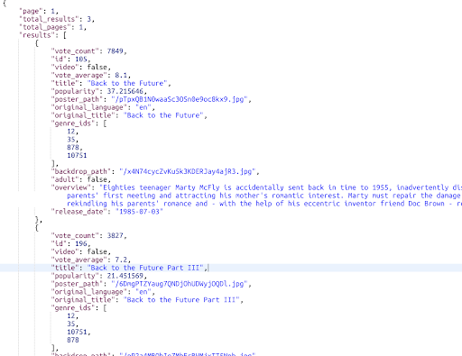
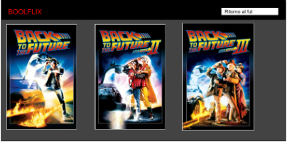
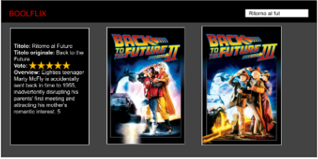
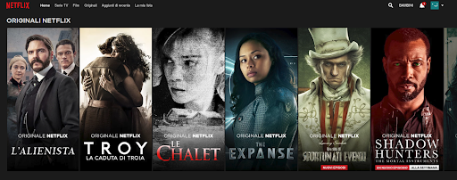

# BoolFlix

## CONSEGNA

In questo esercizio iniziamo a replicare la logica che sta dietro a tantissimi siti che permettono la visione di film e telefilm.  
Per fare questo, come fanno siti molto più rinomati, utilizzeremo un API che ci permette di avere un insieme di risultati congrui alla nostra ricerca.

- Iscriviamoci al sito https://www.themoviedb.org. E’ completamente gratuito. 
- Richiediamo la nostra API_KEY che verrà utilizzata in tutte le nostre chiamate. Servirà all’API a capire chi sta effettuando la chiamata.
- Per richiederla clicchiamo sul nostro user, poi impostazioni, API e clicchiamo su “Richiedi una nuova API key”.
- Una volta generato, in Impostazioni / API avremo la nostra chiave, indispensabile per tutte le nostre chiamate.

A questo url https://developers.themoviedb.org/3 troveremo tutte le chiamate possibili all’API. Possiamo giocarci in un secondo momento, ma come prima cosa concentriamoci su Search > Movies.   
Con questa chiamata possiamo cercare tutti i film associati ad una ricerca (query). Passiamo come parametri query e api_key e vedremo i nostri risultati. Volendo possiamo passare anche language=it-IT per filtrare i risultati in lingua italiana.

Esempio chiamata: 
https://api.themoviedb.org/3/search/movie?api_key=e99307154c6dfb0b4750f6603256716d&query=ritorno+al+futuro

### **Milestone 0:**  
Progettare la struttura del global state sulla linea degli esercizi svolti nei giorni precedenti.

### **Milestone 1:**  
Creare un layout base con una searchbar (una input e un button) in cui possiamo scrivere completamente o parzialmente il nome di un film. Possiamo, cliccando il  bottone, cercare sull’API tutti i film che contengono ciò che ha scritto l’utente.
Vogliamo dopo la risposta dell’API visualizzare a schermo i seguenti valori per ogni film trovato: 
1. Titolo
2. Titolo Originale
3. Lingua
4. Voto

### **Milestone 2:**  
Trasformiamo la stringa statica della lingua in una vera e propria bandiera della nazione corrispondente, gestendo il caso in cui non abbiamo la bandiera della nazione ritornata dall’API (le flag non ci sono in FontAwesome).

Allarghiamo poi la ricerca anche alle serie tv. Con la stessa azione di ricerca dovremo prendere sia i film che corrispondono alla query, sia le serie tv, stando attenti ad avere alla fine dei valori simili (le serie e i film hanno campi nel JSON di risposta diversi, simili ma non sempre identici)
Qui un esempio di chiamata per le serie tv:
https://api.themoviedb.org/3/search/tv?api_key=e99307154c6dfb0b4750f6603256716d&language=it_IT&query=scrubs

### **Milestone 3:**  
In questa milestone come prima cosa aggiungiamo la copertina del film o della serie al nostro elenco. Ci viene passata dall’API solo la parte finale dell’URL, questo perché poi potremo generare da quella porzione di URL tante dimensioni diverse. Dovremo prendere quindi l’URL base delle immagini di TMDB: https://image.tmdb.org/t/p/ per poi aggiungere la dimensione che vogliamo generare (troviamo tutte le dimensioni possibili a questo link: https://www.themoviedb.org/talk/53c11d4ec3a3684cf4006400) per poi aggiungere la parte finale dell’URL passata dall’API.
Esempio di URL:
https://image.tmdb.org/t/p/w342/wwemzKWzjKYJFfCeiB57q3r4Bcm.png

Trasformiamo poi il voto da 1 a 10 decimale in un numero intero da 1 a 5, così da permetterci di stampare a schermo un numero di stelle piene che vanno da 1 a 5, lasciando le restanti vuote (troviamo le icone in FontAwesome).
Arrotondiamo sempre per eccesso all’unità successiva, non gestiamo icone mezze piene (o mezze vuote :P)

### **Milestone 4:**  
Trasformiamo quello che abbiamo fatto fino ad ora in una vera e propria webapp, creando un layout completo simil-Netflix:
- Un header che contiene logo e search bar
- Dopo aver ricercato qualcosa nella searchbar, i risultati appaiono sotto forma di “card” in cui lo sfondo è rappresentato dall’immagine di copertina (consiglio la poster_path con w342)
- Andando con il mouse sopra una card (on hover), appaiono le informazioni aggiuntive già prese nei punti precedenti più la overview

**Mockup:**

**Mockup (on hover sul primo elemento):**

**Esempio finale**

>Consigli: 

1. Andate in fila, seguendo le milestone, non pensate all’interfaccia grafica fino al punto 4
2. Non pensate all’interfaccia grafica fino al punto 4 (si, l’ho scritto due volte), tutto può essere risolto con una `<ul>` non stilizzata
3. Ricordatevi quanto imparato finora con le diverse esercitazioni:
    - Affrontate sempre prima il caso base minimo, senza complicazioni (ad es. _“Se il titolo originale è uguale al titolo, magari dovrei nasconderlo”,_ _“Se faccio una ricerca che non ha nessun risultato dovrei scrivere qualcosa”_ sono domande da NON FARSI fino a quando non si è fatto completamente un caso base)
    - Se ti viene volta di copiare/incollare codice, NON FARLO, fai una funzione! Quei pochi minuti risparmiati renderanno il tuo codice meno leggibile ed ogni volta che dovrai intervenire su quella parte perderai molto più tempo
    - Prima di andare avanti, assicurati di aver risolto quella parte nel miglior modo possibile (codice non ripetuto, minimo codice possibile, funzioni chiare e riutilizzabili). Risparmierai tantissimo tempo risolvendo gli esercizi successivi
    - Meglio risolvere una milestone in meno, ma con codice scritto bene
4. Per avere la lista delle lingue utilizzare: https://en.wikipedia.org/wiki/List_of_ISO_639-1_codes

**SE HAI FINITO LE MILESTONE PRECEDENTI E VUOI ANDARE OLTRE, PUOI FARE LE MILESTONE SUCCESSIVE, MA SONO FACOLTATIVE:**

### **Milestone 5 (Opzionale):**  
Partendo da un film o da una serie, richiedere all'API quali sono gli attori che fanno parte del cast aggiungendo alla nostra scheda Film / Serie SOLO i primi 5 restituiti dall’API con Nome e Cognome, e i generi associati al film con questo schema: “Genere 1, Genere 2, …”.

### **Milestone 6 (Opzionale):**  
Creare una lista di generi richiedendo quelli disponibili all'API e creare dei filtri con i generi tv e movie per mostrare/nascondere le schede ottenute con la ricerca.